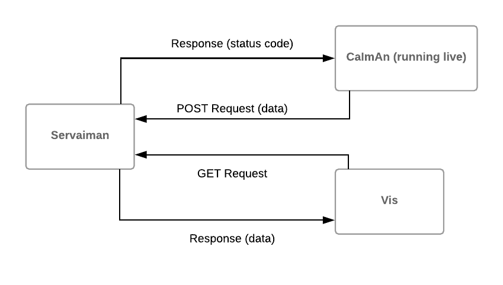

# Servaiman 

Visualization service that graphs the outputs of [CaImAn](https://github.com/flatironinstitute/CaImAn) in live time. Servaiman is optimized for CaImAn's OnACID (Online Analysis of Calcium Imaging Data in Real Time) protocol, but since it's packaged as a separate service can work with other analysis engines with modifications. Contact [tom1193](https://github.com/tom1193) if you're interested in Servaiman for other use cases. 

### Architecture

As OnACID runs, it generates outputs that are posted to the Servaiman service that caches the most recent outputs. A visualization app, Vis, then periodically requests the cached ouputs and renders graphs from it. We use [gRPC](https://grpc.io/) to define the RPC calls between the service and the clients, CaImAn and the vis app. Vis is under construction.

### Interface

We define a method for each major data type in CaIman's output:

Method | Caller | Description
------ | ------ | -----------
PostMeta | CaImAn | Post meta data
PostCn| CaImAn | Post background image
PostAb| CaImAn | Post a matrix encoding *A* and *b*, spatial data of components and background signal respectively.
PostCf| CaImAn | Post a matrix encoding *C* and *f*, temporal activity of components and background signal respectively.
GetMeta| Vis | Get meta data
GetCn| Vis | Get background image
GetAb| Vis | Get a matrix encoding *A* and *b*
GetCf| Vis | Get a matrix encoding *C* and *f*

### Installation 
Servaiman requires python 2.7 or 3.4+ and gRPC. Vis requires the same dependencies (pylab, bokeh) as CaImAn, so it should be run in the CaImAn environment. For CaImAn to call Servaiman, gRPC needs to be added to the caiman virtual environment.
